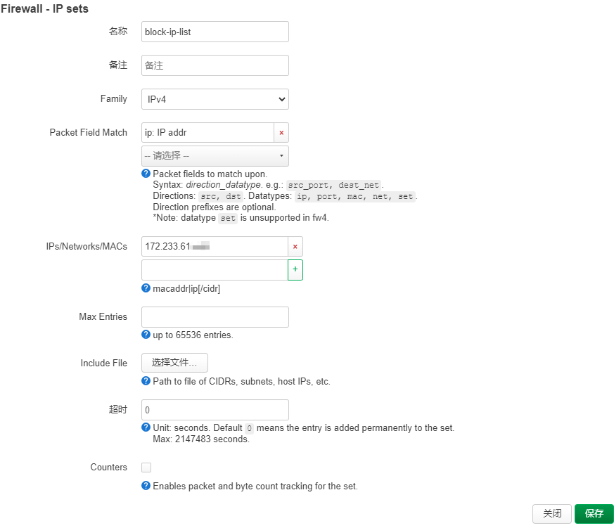
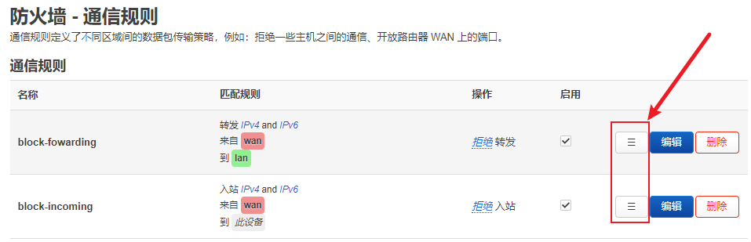

家里的路由器安装了 iStoreOS 作为主路由，用 DDNS-go 动态域名暴露在公网。通过端口转发，用 Nginx-Proxy-Manager 配置了 HTTPS 证书，也配置了 ssh 端口转发。

最近发现系统日志有很多暴力破解我的 ssh，日志长这样：

```
authpriv.info dropbear[15168]: Child connection from 172.233.61.xxx:51055
authpriv.warn dropbear[15168]: Login attempt for nonexistent user
```

这个日志记录的是来源IP(172.233.61.xxx) 尝试暴力破解我的 ssh 账号，如果不主动阻止来源IP的继续访问，openwrt 系统本身是不会防护的。网上有其他方式，用脚本和 iptable 命令、结合定时任务来防护，我觉得有点复杂，不方便界面操作。下面我实践并验证了，通过几步简单的设置，可以实现阻止来源IP的任意流量的入站。

## 第一步，创建一个 IP sets

1. 找到设置页面：网络-防火墙-IP集（/cgi-bin/luci/admin/network/firewall/ipsets）
2. 点击“添加”按钮
3. 按照如图，把需要阻止的 IP 填写如下：


## 第二步，创建通信规则

通信规则阻止来源IP，分别有拒绝入站、拒绝转发，因为我都是基于端口转发暴露 ssh 和 luci 管理界面的，所以创建的规则是拒绝转发。

1. 创建规则：block-forwading
2. 高级设置，选择 Use Ipset，选项就是第一步创建的 IP sets
3. 源区域：wan
4. 目标区域：任意区域（转发）
5. 高级选项，Use ipset，选择第一步创建的 IP sets
![[rules-forwarding-1.png]]
![[rules-forwarding-2.png]]

## 第三步，设置优先级

用鼠标拖拽下图中红色按钮，把以上2个规则放到通信规则的最上面，否则可能不生效。



## 最后，验证

把云主机的公网IP，添加到路由器防火墙 IP sets 里，尝试在云主机登录我的路由器，如果显示**Network is unreachable**就是设置成功了：

```
ssh -l root -p 2345 我的路由器域名
ssh: connect to host 我的路由器域名n port 2345: Network is unreachable
```

也验证下 HTTPS 访问 luci 界面（域名、IP手动打码了），日志返回**Connection refused**，就是被拒绝了：

```
curl https://我的路由器域名:3344 -v
*   Trying 113.110.xxx.xxx:3344...
* TCP_NODELAY set
* connect to 113.110.xxx.xxx port 3344 failed: Connection refused
*   Trying 240e:3b4:38d5:70a0::1:3344...
* TCP_NODELAY set
* Immediate connect fail for 240e:3b4:...::1: Network is unreachable
*   Trying 240e:3b4:...::1:3344...
* TCP_NODELAY set
* Immediate connect fail for 240e:3b4:,,,::1: Network is unreachable
* Failed to connect to nas.imcolin.fan port 3344: Connection refused
* Closing connection 0
curl: (7) Failed to connect to 我的路由器域名 port 3344: Connection refused
```

-- 完 --